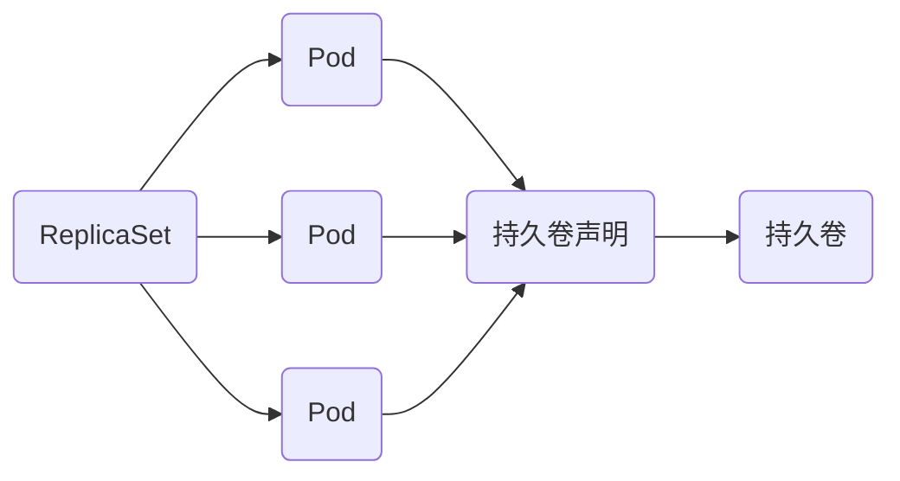
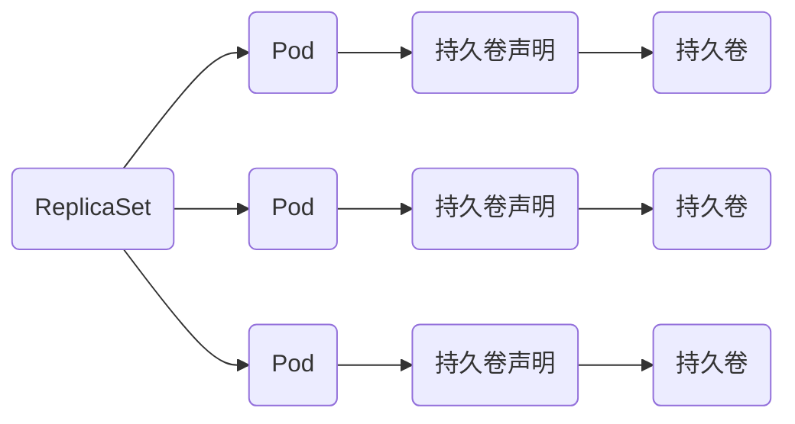

## StatefullSet

宠物与牛的类比。sts创建的pod像宠物（必须完全一致用户才无感知），rs和rc创建的pod像牛（不一样用户也无感知）。

sts提供有规律的pod名称。

以前的controller仅能提供这样的结构（结构1）



不能提供如下的结构（结构2）



该yaml演示了使用rs创建的pod共享一个持久卷（即只能产出结构1）。pvc和sc的创建参考对应章节。

```yaml
apiVersion: apps/v1
kind: ReplicaSet
metadata:
  name: rs-test
spec:
  replicas: 3
  selector:                  
    matchLabels:             
      app: redis             
  template:
    metadata:
      labels:
        app: redis
    spec:
      containers:
      - name: redis
        image: bitnami/redis:5.0.3
        volumeMounts:
        - name: redis-vol
          mountPath: /data/db
        env:
        - name: ALLOW_EMPTY_PASSWORD
          value: "yes"
      volumes:
      - name: redis-vol
        persistentVolumeClaim:
          claimName: pvc-nfs-sc
```

