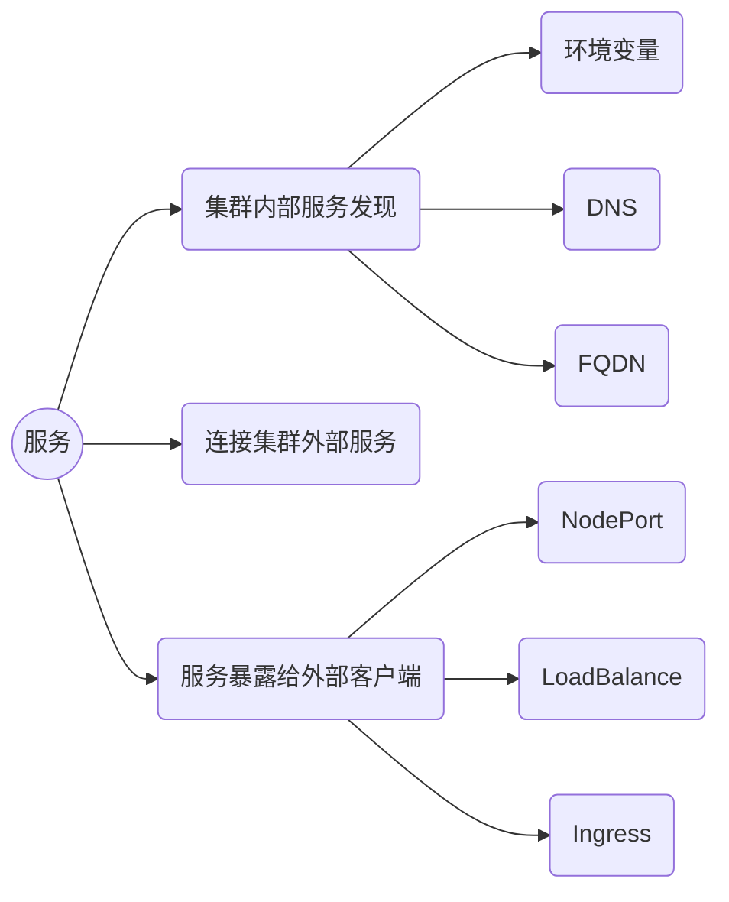

## 服务（Service）

Service是为一组功能相同的pod提供单一不变的接入点的资源。

Service的2个目标：

使集群内部的其他pod可以访问当前的这组pod。（web的pod可以访问数据库的pod）

外部可以访问。（集群外的客户端访问集群内web的pod）




service<-->endpoint<->pod

service<-->endpoint<->external server

endpoint资源


在外部访问service的几种方式

注意service的type，clusterip loadbalancer nodeport externalname

kubectl get po --all-namespace简写为kubectl get po -A

kubtctl apply -f xxx.yaml


### 创建service

定义svc.yaml

```yaml
apiVersion: v1
kind: Service
metadata:
  name: redis-svc
spec:
  ports:
  - port: 16379             ## service对外的供集群内客户端pod访问的端口
    targetPort: 6379        ## service转发16379收到的请求->容器的6379端口
  selector:
    app: redis
```

可以回顾下ReplicationController或者ReplicaSet的yaml文件，看下我们定义的pod使用哪个端口，以下是ReplicationController的yaml文件定义。可以看到pod容器的端口定义为6379（`- containerPort: 6379`）。

```yaml
apiVersion: v1
kind: ReplicationController
metadata:
  name: redis-rc
spec:
  replicas: 3                 ## 会创建3的pod
  template:
    metadata:
      labels:
        app: redis            ## pod标签是app=redis
    spec:
      containers:
      - name: redis
        image: bitnami/redis
        ports:
        - containerPort: 6379
```

### 会话亲和性

通过在yaml中指定spec.sessionAffinity配置会话亲和性。

- ClientIP：将来自同一个IP的客户端请求都转发到同一个pod上
- None：默认值

配置会话亲和性的yaml示例，svc-sa.yaml。-sa（SessionAffinity）

```yaml
apiVersion: v1
kind: Service
metadata:
  name: redis-svc-sa
spec:
  sessionAffinity: ClientIP ## 客户端产生的所有请求每次都指向同一个pod。默认值为None
  ports:
  - port: 16379             ## service对外的供集群内客户端pod访问的端口
    targetPort: 6379        ## service转发16379收到的请求->容器的6379端口
  selector:
    app: redis
```

注意：k8s的service不支持基于cookie的会话亲和性，因为k8s的service不是在HTTP层面上工作的。而cookie是HTTP协议的一部分。

### 一个服务暴露多个端口

一个服务暴露多个端口的示例，svc-mp.yaml。-mp（multiple-port）

```yaml
apiVersion: v1
kind: Service
metadata:
  name: redis-svc-mp
spec:
  sessionAffinity: ClientIP ## 客户端产生的所有请求每次都指向同一个pod。默认值为None
  ports:
  - name: redis-port        ## redis端口名称
    port: 16379             ## service对外暴露的供集群内客户端pod访问的端口
    targetPort: 6379        ## service转发16379收到的请求->容器的6379端口
  - name: https-port        ## https端口名称
    port: 443               ## service对外暴露的供集群内客户端pod访问的端口
    targetPort: 8443        ## service转发443收到的请求->容器的8443端口
  selector:
    app: redis
```

**注意**：可以看到这次的`ports`列表中，除了`port`和`targetPort`，还增加了一个`name`字段。这是因为k8s规定了，创建多端口的service时，必须给每个端口指定名称。

### 使用命名的端口

pod命名端口示例yaml，svc-pod-np.yaml。-np（Named Port）

```yaml
apiVersion: v1
kind: Pod                 ## 资源类型是pod
metadata:
  name: redis-pod-np   ## pod的名称
spec:
  containers:
  - name: redis
    image: bitnami/redis
    ports:
    - name: redis-port
      containerPort: 6379
    - name: https-port
      containerPort: 8443
```

可以看到，在svc-pod.yaml中`spec.containers.ports.name`为端口定义了名称（name）。这样，在svc-np.yaml中，就可以在`spec.ports.name`字段上使用名称`redis-port`和`https-port`进行引用。


同样的，在ReplicationController的yaml中也可以使用命名端口，ReplicationController命名端口示例yaml，svc-rc-np.yaml。-np（Named Port）

```yaml
apiVersion: v1
kind: ReplicationController
metadata:
  name: redis-rc-np
spec:
  replicas: 3                 ## 会创建3的pod
  template:
    metadata:
      labels:
        app: redis            ## pod标签是app=redis
    spec:
      containers:
      - name: redis-np
        image: bitnami/redis
        ports:
        - name: redis-port
          containerPort: 6379
        - name: https-port
          containerPort: 8443
```

使用命名端口的service的yaml，svc-np.yaml。-np（Named Port）

```yaml
apiVersion: v1
kind: Service
metadata:
  name: redis-svc-np
spec:
  sessionAffinity: ClientIP ## 客户端产生的所有请求每次都指向同一个pod。默认值为None
  ports:
  - name: redis-port        ## redis端口名称
    port: 16379             ## service对外的供集群内客户端pod访问的端口
    targetPort: redis-port  ## service转发16379收到的请求->容器的名为redis-port的端口
  - name: https-port        ## https端口名称
    port: 443               ## service对外暴露的另一个供集群内客户端pod访问的端口
    targetPort: https-port  ## service转发443收到的请求->容器的名为https-port的端口
  selector:
    app: redis
```

为什么要使用命名端口（Named Port）。因为service和pod都使用了命名端口，这样就解耦了service与pod的端口号。这样，pod可以任意变更端口号，而service的spec不需要做任何改变。


