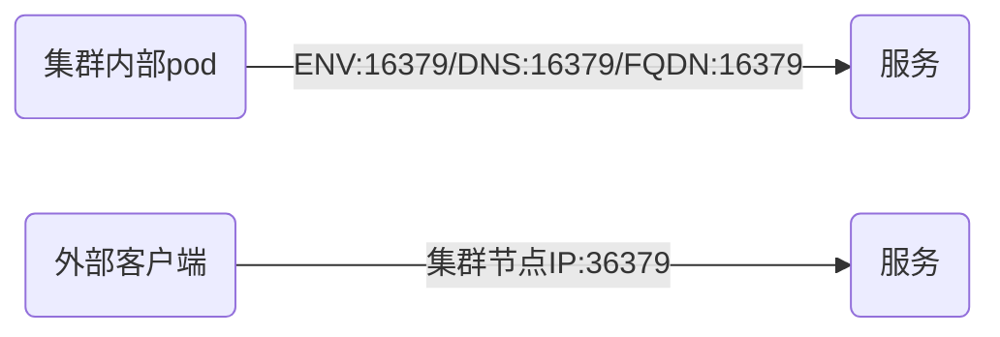

## 将服务暴露给外部客户端

其实仍然是通过服务暴露，只不过讨论的是服务的类型

一共四种，NodePort，LoadBalancer，Ingress（不是服务类型，而是一种k8s资源），Headless

如果不指定Service的类型，默认就是`ClusterIP`类型的服务，`ClusterIP`仅能在集群内部被别的pod访问。要让集群外部的客户端可以访问服务，需要将服务的类型设置为`NodePort`（`NodePort`也可以在集群内部被pod访问）。

### 一、NodePort

创建类型为`NodePort`的服务，示例yaml，svc-np.yaml

```yaml
apiVersion: v1
kind: Service
metadata:
  name: redis-svc-np
spec:
  type: NodePort            ## 指定服务类型为NodePort
  ports:
  - port: 16379             ## service对外的供集群内客户端pod访问的端口
    targetPort: 6379        ## service转发16379收到的请求->容器的6379端口
    nodePort: 36379         ## 通过集群节点的36379端口可以访问到该服务（供集群外部客户端访问的端口）
  selector:
    app: redis
```

集群内部的pod通过16379端口访问服务；集群外部，通过36379端口访问服务。

**注意**：节点的端口号范围是30000-52767。



```shell
$ kubectl get svc redis-svc-np
NAME           TYPE       CLUSTER-IP     EXTERNAL-IP   PORT(S)           AGE
redis-svc-np   NodePort   10.43.104.95   <none>        16379:36379/TCP   95s

## PORT列，前面的是服务的端口，后面的是集群节点的端口
## 要访问服务，可以通过以下几种方式：
## 10.43.104.95:16379
## <node1-ip>:36379
## <node2-ip>:36379
## ...

## 和从内部集群测试服务一样，我们自己的service对应的pod没有就绪（内网拉取不到docker镜像）。
## 继续使用语音识别的service
## 用语音识别中已存在的NodePort服务进行测试
$ kubectl get svc --namespace=cattle-system
NAME              TYPE        CLUSTER-IP     EXTERNAL-IP   PORT(S)                      AGE
rancher           ClusterIP   10.43.183.64   <none>        80/TCP                       95d
rancher-exposed   NodePort    10.43.57.10    <none>        80:30080/TCP,443:30443/TCP   95d

## 在本机使用节点的IP和服务的NodePort端口进行访问
$ curl http://192.168.42.79:30080
<a href="https://192.168.42.79:30443/">Found</a>.

## 在别的机器使用节点的IP和服务的NodePort端口进行访问
[websrv@centos7-web-213 ~]$ curl http://192.168.42.79:30080
<a href="https://192.168.42.79:30443/">Found</a>.
```


外部客户端访问集群节点的端口（spec.ports.nodePort），在转发到pod内容器的端口（spec.ports.targetPort）。

### 二、LoadBalancer

`NodePort`的问题在于，必须使用节点的IP来访问。如果节点发生故障，虽然服务会迁移到别的节点，通过新的节点IP也可以访问服务；但是外部客户端无法知道节点IP发生了变化，他仍然会访问故障节点的IP。

解决的方法就是使用`LoadBalancer`类型的服务（Service）。

**注意**：如果k8s在不支持`LoadBalancer`服务的环境中运行，`LoadBalancer`类型的服务（Service）表现和`NodePort`类型的服务一样。

创建类型为`LoadBalancer`的服务，示例yaml，svc-lb.yaml

```yaml
apiVersion: v1
kind: Service
metadata:
  name: redis-svc-lb
spec:
  type: LoadBalancer        ## 指定服务类型为LoadBalancer
  ports:
  - port: 80                ## service对外的端口，不管负载均衡是否可用，内部pod都可以通过该端口访问。
                            ## 负载可用，外部客户端就可以通过该端口转发到节点端口（spec.ports.nodePort）
                            ## 负载不可用，外部客户端只能通过节点端口访问
    targetPort: 6379        ## service转发节点端口收到的请求->容器的6379端口
    nodePort: 36379         ## 通过集群节点的36379端口可以访问到该服务（如不指定，随机分配）
  selector:
    app: redis
```

```shell
## 继续使用语音识别的service
## 用语音识别中已存在的LoadBalancer服务进行测试
## 可以看到service vprc是LoadBalancer类型的服务，负载均衡端口为8070，节点端口为35435
$ kubectl get svc --namespace=prod
NAME                    TYPE           CLUSTER-IP      EXTERNAL-IP   PORT(S)             AGE
vprc                    LoadBalancer   10.43.121.42    <pending>     8070:35435/TCP      96d
vprc-exposed            NodePort       10.43.59.186    <none>        8070:38070/TCP      96d
...

## 查看service的yaml文件验证下
$ kubectl get svc vprc -o yaml
...
spec:
  ports:
  - name: vprc-svc-port
    nodePort: 35435
    port: 8070
    protocol: TCP
    targetPort: 8070
...

## 由于LoadBalancer未生效，所以使用负载均衡端口无法访问
$ curl http://192.168.42.79:8070
curl: (7) Failed connect to 192.168.42.79:8070; Connection refused

## LoadBalancer可能需要硬件支持，像Amazon ECS或Google GCP自己实现了。
## 中心赛克为了应对节点故障，在Node之上使用keepalived做了负载，由他来实现LoadBalancer的功能

## 找一个pod在集群内部访问
## 这个8070是targetPort
$ kubectl exec redis-master-0 -- curl http://10.43.121.42:8070
  % Total    % Received % Xferd  Average Speed   Time    Time     Time  Current
                                 Dload  Upload   Total   Spent    Left  Speed
100   810  100   810    0     0   502k      0 --:--:-- --:--:-- --:--:--  791k
<!DOCTYPE html><html><head><meta charset=utf-8><meta http-equiv=X-UA-Compatible content="IE=edge,chrome=1"><meta name=renderer content=webkit><meta name=viewport content="width=device-width,initial-scale=1,maximum-scale=1,user-scalable=no"><title>Audvoc Voiceplus云服务开放平台</title><link rel="shortcut icon" href=/devmgr/favicon.ico><link href=/devmgr/static/css/app.fdff6b6682b737d730799097c746a821.css rel=stylesheet></head><body><script src=/devmgr/static/tinymce4.7.5/tinymce.min.js></script><div id=app></div><script type=text/javascript src=/devmgr/static/js/manifest.c3a9a714bf227a6a5c93.js></script><script type=text/javascript src=/devmgr/static/js/vendor.2d2806329e3dca3f81e2.js></script><script type=text/javascript src=/devmgr/static/js/app.4a907a9e1e7ff353d21b.js></script></body></html>

## 由于LoadBalancer未生效，所以该服务应该表现的和NodrPort类型的服务一样
## 使用NodePort验证
$ curl http://192.168.42.79:35435
<!DOCTYPE html><html><head><meta charset=utf-8><meta http-equiv=X-UA-Compatible content="IE=edge,chrome=1"><meta name=renderer content=webkit><meta name=viewport content="width=device-width,initial-scale=1,maximum-scale=1,user-scalable=no"><title>Audvoc Voiceplus云服务开放平台</title><link rel="shortcut icon" href=/devmgr/favicon.ico><link href=/devmgr/static/css/app.fdff6b6682b737d730799097c746a821.css rel=stylesheet></head><body><script src=/devmgr/static/tinymce4.7.5/tinymce.min.js></script><div id=app></div><script type=text/javascript src=/devmgr/static/js/manifest.c3a9a714bf227a6a5c93.js></script><script type=text/javascript src=/devmgr/static/js/vendor.2d2806329e3dca3f81e2.js></script><script type=text/javascript src=/devmgr/static/js/app.4a907a9e1e7ff353d21b.js></script></body></html>

## 在别的机器使用NodePort验证
$ curl http://192.168.42.79:35435
<!DOCTYPE html><html><head><meta charset=utf-8><meta http-equiv=X-UA-Compatible content="IE=edge,chrome=1"><meta name=renderer content=webkit><meta name=viewport content="width=device-width,initial-scale=1,maximum-scale=1,user-scalable=no"><title>Audvoc Voiceplus云服务开放平台</title><link rel="shortcut icon" href=/devmgr/favicon.ico><link href=/devmgr/static/css/app.fdff6b6682b737d730799097c746a821.css rel=stylesheet></head><body><script src=/devmgr/static/tinymce4.7.5/tinymce.min.js></script><div id=app></div><script type=text/javascript src=/devmgr/static/js/manifest.c3a9a714bf227a6a5c93.js></script><script type=text/javascript src=/devmgr/static/js/vendor.2d2806329e3dca3f81e2.js></script><script type=text/javascript src=/devmgr/static/js/app.4a907a9e1e7ff353d21b.js></script></body></html>
```


外部客户端访问LoadBalancer的80端口（spec.ports.port），转发到集群节点的端口（spec.ports.nodePort），再转发到pod内容器的端口（spec.ports.targetPort）。

### 三、Ingress

每个LoadBalancer服务都需要一个独有的IP，而Ingress只需要一个IP就可以为许多服务提供访问。外部客户端向Ingress发送HTTP请求时，Ingress会根据请求的主机名和路径决定请求转发到的服务。


**注意**：Ingress可以提供基于cookie的会话亲和性。

**注意**：`Ingress`和`NodePort`，`LoadBalancer`不太一样，从yaml文件就能看出，它的`kind`不是`Service`而是`Ingress`。`NodePort`和`LoadBalancer`的`kind`仍然是`Service`，通过`spec.type`来区分`NodePort`和`LoadBalancer`。`Ingress`是控制器。

**注意**：Ingress资源要正常运行，集群中需要有Ingress控制器。Ingress控制器通常运行在一个pod上。

```shell
## 查看集群中有没有启用Ingress控制器
## 可以看到有2个和ingress-controller相关的pod，除了一个已经Completed的，剩下的那个应该就是ingress controller
$ kubectl get po -A | grep ingress-controller
ingress-nginx   nginx-ingress-controller-65gq6             1/1     Running            6          96d
kube-system     rke-ingress-controller-deploy-job-cblqg    0/1     Completed          0          96d
```

先创建一个自己的Ingress资源，示例ing.yaml

```yaml
apiVersion: extensions/v1beta1
kind: Ingress                         ## 注意kind不是Service而是Ingress
metadata:
  name: redis-ing
spec:
  rules:
  - host: owls.sinovatio.com
    http:
      paths:
      - path: /
        backend:
          serviceName: redis-svc-np
          servicePort: 16379          ## NodePort服务中的port（spec.ports.port）
```

```shell
## 从文件创建Ingress资源
$ kubectl create -f ing.yaml 
ingress.extensions/redis-ing created

## 查看刚创建的Ingress资源可以看到ADDRESS尚未分配
$ kubectl get ing
NAME         HOSTS                ADDRESS         PORTS     AGE
redis-ing    owls.sinovatio.com                   80        4s
voiceai-l7   vprc.k8s.zxsk.com    192.168.42.79   80, 443   96d

## 一段时间后刚创建的Ingress资源分配到IP地址
$ kubectl get ing
NAME         HOSTS                ADDRESS         PORTS     AGE
redis-ing    owls.sinovatio.com   192.168.42.79   80        2m11s
voiceai-l7   vprc.k8s.zxsk.com    192.168.42.79   80, 443   96d

## 换一台主机使用域名测试Ingress
## 由于背后的服务和pod未就绪（无法拉取镜像），所以无法继续测试
$ curl http://owls.sinovatio.com
<html>
<head><title>503 Service Temporarily Unavailable</title></head>
<body>
<center><h1>503 Service Temporarily Unavailable</h1></center>
<hr><center>openresty/1.15.8.1</center>
</body>
</html>
```

```shell
## 使用语音识别的服务进行测试

## 查看当前有哪些Ingress资源
$ kubectl get ing -A
NAMESPACE       NAME         HOSTS               ADDRESS         PORTS     AGE
cattle-system   rancher      k8s.zxsk.com        192.168.42.79   80, 443   96d
prod            voiceai-l7   vprc.k8s.zxsk.com   192.168.42.79   80, 443   96d

## 查看名为rancher的Ingress资源的yaml定义
## 说明名为rancher的Ingress资源背后对应的服务是rancher
$ kubectl get ing rancher --namespace=cattle-system -o yaml
...
spec:
  rules:
  - host: k8s.zxsk.com
    http:
      paths:
      - backend:
          serviceName: rancher
          servicePort: 80
...

## 查看名为cattle-system命名空间下的Service
$ kubectl get svc --namespace=cattle-system
NAME              TYPE        CLUSTER-IP     EXTERNAL-IP   PORT(S)                      AGE
rancher           ClusterIP   10.43.183.64   <none>        80/TCP                       100d
rancher-exposed   NodePort    10.43.57.10    <none>        80:30080/TCP,443:30443/TCP   100d

## 选择名为rancher的Ingress资源进行验证
## 在另一台主机上测试名为rancher的Ingress资源
## 似乎是有问题的，虽然有返回，但是好像不太符合预期
[root@centos7-web-213 bin]$ curl http://k8s.zxsk.com:80
<html>
<head><title>308 Permanent Redirect</title></head>
<body>
<center><h1>308 Permanent Redirect</h1></center>
<hr><center>openresty/1.15.8.1</center>
</body>
</html>

## 名为rancher的Service是ClusterIP类型的（既不是NodePort（可以用节点IP从外部访问），也不是LoadBalancer）
## ClusterIP只能从pod内部进行测试，但是它的前面有rancher Ingress
## 而rancher-exposed这个服务是NodePort类型的，可以在外部通过节点IP访问
## 所以如果我们在另一台机器上使用域名k8s.zxsk.com（解析为192.168.42.79）
## 访问的可能是rancher-exposed服务也可能是通过rancher Ingress访问的rancher服务
## 这一点暂时未搞懂
$ kubectl exec redis-master-0 -- curl http://10.43.183.64:80
  % Total    % Received % Xferd  Average Speed   Time    Time     Time  Current
                                 Dload  Upload   Total   Spent    Left  Speed
100    44  100    44    0     0  60027      0 --:--:-- --:--:-- --:--:-- 44000
<a href="https://10.43.183.64/">Found</a>.
```

### 四、Headless

将clusterIP字段设置为None，该服务就是Headless的。示例yaml，svc-hl.yaml

```yaml
apiVersion: v1
kind: Service
metadata:
  name: redis-svc-hl
spec:
  clusterIP: None
  ports:
  - port: 16379
    targetPort: 6379
  selector:
    app: redis
```

```shell
## 从文件创建headless服务
$ kubectl create -f svc-hl.yaml 
service/redis-svc-hl created

## 查看服务
## 可以看到CLUSTER-IP为None
$ kubectl get svc redis-svc-hl
NAME                    TYPE           CLUSTER-IP      EXTERNAL-IP   PORT(S)             AGE
redis-svc-hl            ClusterIP      None            <none>        16379/TCP           5s
```

headless和其他服务的区别：

|         | Headless                          | 其他服务                 |
| ------- | --------------------------------- | ------------------------ |
| DNS查找 | 返回满足服务selector的所有pod的IP | 返回服务本身的CLUSTER-IP |

